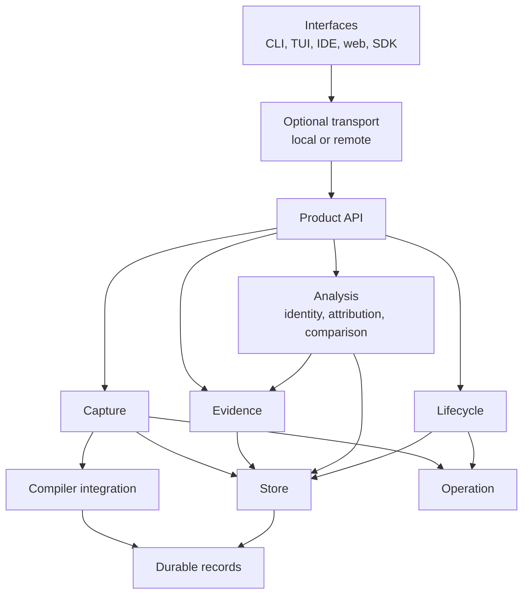
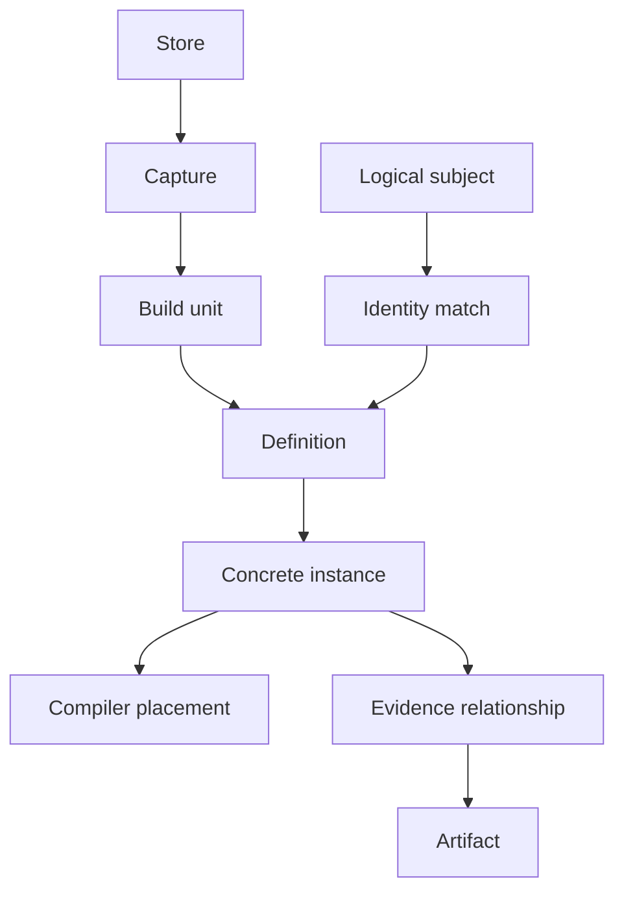
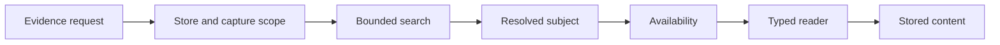
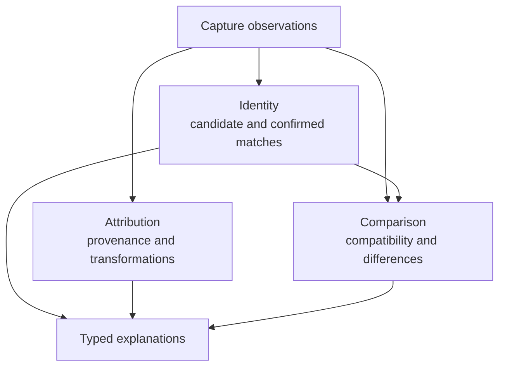
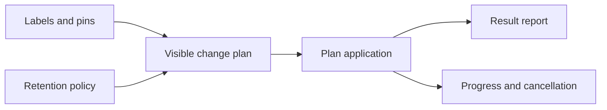
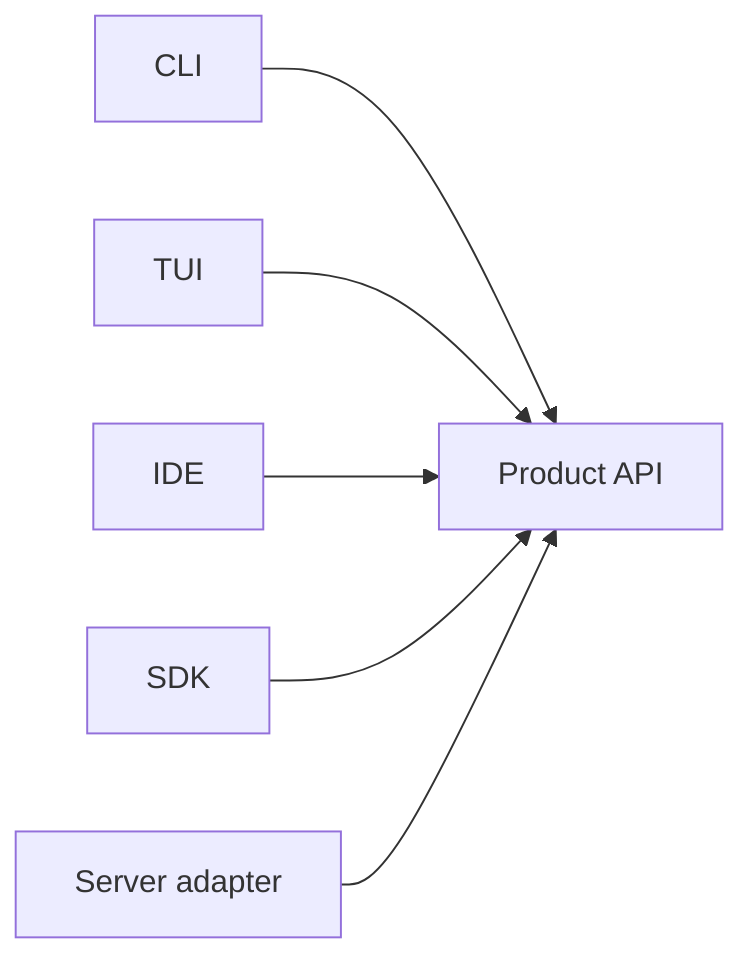

# Future architecture

This document describes the possible long-term shape of Cargo Optic. It defines boundaries through
public APIs, not through implementation choices.

The architecture does not require SQLite, a command-line interface, or a local-only process. These
choices are possible implementations of stable product contracts.

The [MVP architecture](mvp-architecture.md) describes the first complete package set. The
[MVP plan](mvp-plan.md) describes the first implementation milestone.

## Product purpose

Cargo Optic answers this question:

> What did the selected compiler produce for this concrete Rust instance in this Cargo build?

An answer can contain source, compiler stages, native code, optimization reports, and build
provenance. The answer must preserve its relationship to the compiler instance and build.

Cargo Optic is not a profiler, benchmark runner, build system, or general compiler debugger.

## Design principles

- Each subsystem owns one product capability and its terms.
- Each interface uses the same product API.
- A capture contains immutable observations from one build.
- A logical identity never replaces a capture-local identity.
- Every durable reference includes its store scope.
- An exact relationship remains separate from an inferred relationship.
- An inferred relationship records its method and confidence.
- A storage API does not expose a database or file layout.
- A destructive operation produces a visible plan before it changes data.
- A trait requires a second implementation or a real external boundary.
- Public contracts do not expose rustc-private types.

## Top-level shape

The product API is the common entry point for applications. The subsystem APIs remain useful to
consumers that need lower-level control.



The optional transport preserves the product contract across a process or network boundary. A
local interface can call the product API directly.

## Subsystem catalog

The word *contract* means a public request, result, record, or behavior. A contract does not require
a Rust trait.

| Subsystem | Public responsibility |
| --- | --- |
| Product API | Compose subsystem operations and select product defaults. |
| Capture | Turn one capture request into one immutable capture. |
| Compiler integration | Obtain build facts and compiler evidence. |
| Store | Address, publish, and read durable evidence. |
| Evidence | Find subjects and read typed evidence. |
| Identity | Link observations that represent one logical subject. |
| Attribution | Explain source-to-artifact and transformation relationships. |
| Comparison | Align subjects and compare compatible evidence. |
| Lifecycle | Manage mutable metadata and destructive store operations. |
| Operation | Report progress, cancellation, and final results. |
| Durable records | Define versioned data that crosses a process or disk boundary. |
| Interface | Adapt the product API to a person or another program. |
| Transport | Carry versioned product requests and results between processes. |

## Evidence model

The evidence model separates compiler observations from later interpretation.



A definition is one source-level item. An instance is one concrete compiler form of a definition.
A generic definition can have many instances.

A placement records where the compiler placed an instance. One instance can have several
placements and several compiler-stage records.

An evidence relationship connects a subject to an artifact or another subject. The relationship
records its producer and method.

An exact raw symbol can connect records inside one capture. Equal raw symbols in different captures
do not prove logical identity.

## Capture and compiler integration

The capture subsystem owns product policy. The compiler subsystem owns Cargo, rustc, and artifact
integration.

```mermaid
flowchart LR
    intent["Capture intent"]
    plan["Capture plan"]
    graph["Cargo build graph"]
    compiler["Compiler connection"]
    collectors["Evidence collectors"]
    staged["Staged capture"]
    publish["Store publication"]
    result["Capture reference"]

    intent --> plan
    plan --> graph
    graph --> compiler
    compiler --> collectors
    collectors --> staged
    staged --> publish
    publish --> result
```

The capture planner resolves targets, toolchains, evidence requests, dependencies, and reuse
choices. The capture coordinator performs that plan.

The compiler connection reports capabilities. The first connection uses Cargo, rustc, and LLVM.
Another compiler connection can implement the same capture concepts.

Collectors produce typed records and artifact descriptions. The capture plan selects collectors.
A collector does not select build targets.

Possible collectors include:

- Rust source.
- MIR.
- LLVM IR.
- Optimization reports.
- Assembly.
- Object and symbol data.
- Linked products.
- Debug and inline data.

## Store and evidence access

The store subsystem owns durable access. The evidence subsystem owns bounded queries and typed
readers.



Each query has an explicit scope, stable order, and result limit. Each content reader has a bounded
range or chunk size.

Evidence availability distinguishes these states:

- The capture did not request the evidence.
- The compiler did not produce the evidence.
- The store contains the evidence.
- The store contains invalid or incomplete evidence.

The store reports its capabilities. A local directory, a database, and a remote service can all
implement the same product contract.

A federated read view can combine several stores. Federation does not imply that each store supports
writes or lifecycle operations.

## Identity, attribution, and comparison

These subsystems interpret stored observations. They do not change the original compiler facts.



Identity finds and records links between captures. A link records its method, evidence, and
confidence. The subsystem can retain several candidates without selecting one answer.

Attribution explains where code came from and how the compiler changed it. Inline occurrences
remain separate subjects because one instance can contribute to several bodies.

Comparison aligns subjects before it compares evidence. Each result reports compatibility for the
toolchain, target, profile, and evidence types.

Static structure does not prove a runtime-performance difference. Comparison results must keep this
limit visible.

## Lifecycle and operations

Captures remain immutable. Labels, pins, retention rules, and removal plans are mutable records that
refer to captures.



A lifecycle plan lists each affected capture and content object. The caller can inspect the plan
before application.

The operation subsystem gives each interface the same model for long work. An operation reports
ordered events, cancellation, and one typed result.

Local synchronous work can use this contract without an asynchronous runtime. Remote or concurrent
work can add durable operation identifiers later.

## Interfaces and transport

Interfaces own input parsing, presentation, terminal state, and protocol messages. They do not own
capture, evidence, or storage policy.



A remote interface uses a versioned protocol for the same requests and results. The protocol does
not become a second product API.

## Package boundaries

A package needs at least one of these reasons:

- It owns a product subsystem.
- Several subsystems use its durable contract.
- It isolates a material dependency or process boundary.
- An application needs it without another interface.
- It needs a separate compatibility policy.

Internal helpers do not need separate packages. Cargo, rustc, and LLVM adapters can remain modules
until another implementation creates a useful boundary.

## Growth rules

New evidence types extend compiler integration, durable records, and evidence readers. They do not
require a new top-level architecture.

New interfaces depend on the product API. They do not depend on another interface.

A second storage adapter can justify a store trait. The first storage adapter does not require one.

A remote deployment can add transport packages. The in-process product contracts remain the same.

Better identity and attribution add interpreted relationships. They do not change exact capture
records.
