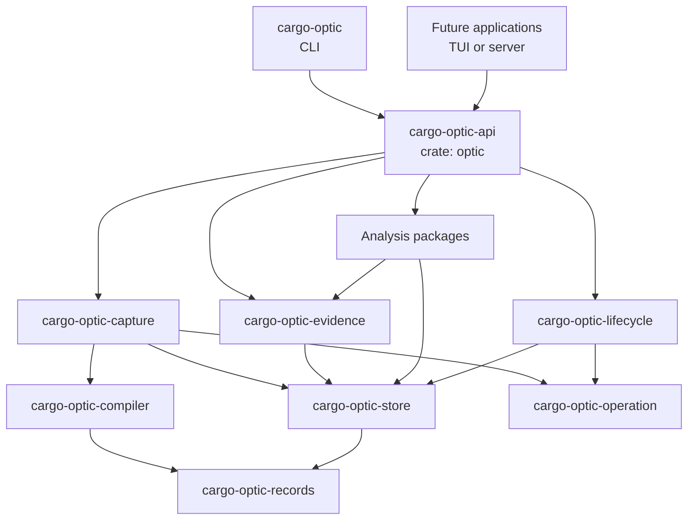
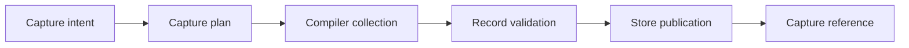
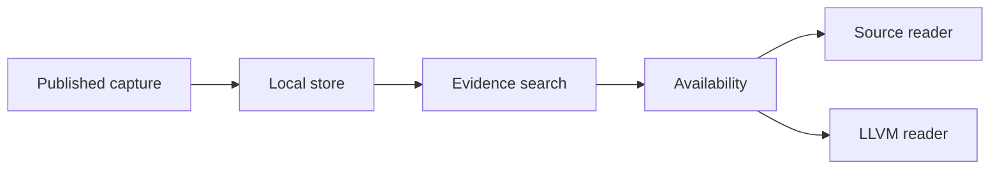
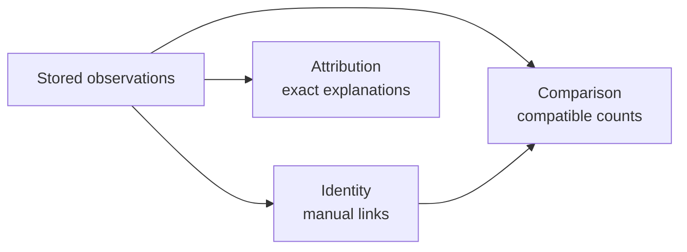
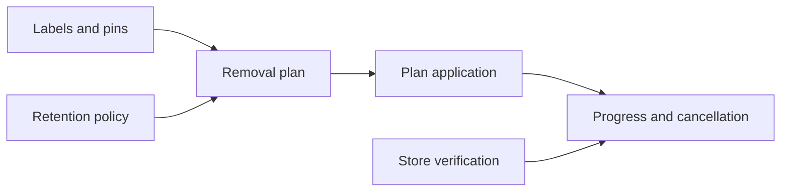

# MVP architecture

This document describes the first complete Cargo Optic architecture. Each subsystem starts with one
small implementation that proves its public contract.

The complete architecture is larger than the first implementation milestone. The
[MVP plan](mvp-plan.md) introduces it through user-visible behavior.

The [future architecture](future-architecture.md) describes later interfaces, evidence types,
storage adapters, and deployment models.

## Product claim

Cargo Optic records compiler evidence from one real Cargo target. It finds concrete Rust instances
and shows their captured source or optimized LLVM body.

The exact-version rustc driver is part of the correctness boundary. The prototype proved that
display names cannot provide an exact instance-to-body relationship.

The first implementation favors clear code over speed. It can use linear scans, repeated
compilation, and one local directory.

## Architecture rules

- Each subsystem owns one public vocabulary and one set of invariants.
- Each subsystem maps to one published package.
- Each package contains useful behavior when it enters the workspace.
- Concrete types and functions come before traits.
- A package does not contain a trait for one implementation.
- Durable cross-process records stay in `cargo-optic-records`.
- The `optic` crate is the supported application API.
- Slow linear scans are acceptable.
- Repeated compilation is acceptable.
- Missing compiler evidence is a valid result.
- An optimization requires evidence from real use.
- An independent agent reviews every implementation line before merge.
- Unsupported input returns a clear error instead of speculative compatibility behavior.

## Package names

Cargo Optic uses the `cargo-optic-*` package prefix. The Rust crate names remain short.

| Package | Rust crate | Responsibility |
| --- | --- | --- |
| `cargo-optic-records` | `optic_records` | Durable records, scoped identifiers, and validation. |
| `cargo-optic-compiler` | `optic_compiler` | Cargo, rustc, source, and LLVM integration. |
| `cargo-optic-store` | `optic_store` | Durable storage and bounded artifact reads. |
| `cargo-optic-capture` | `optic_capture` | Capture planning, collection, and publication. |
| `cargo-optic-evidence` | `optic_evidence` | Evidence search, availability, and readers. |
| `cargo-optic-identity` | `optic_identity` | Cross-capture candidates and confirmed links. |
| `cargo-optic-attribution` | `optic_attribution` | Explain exact relationships. |
| `cargo-optic-comparison` | `optic_comparison` | Compatibility reports and evidence comparison. |
| `cargo-optic-lifecycle` | `optic_lifecycle` | Stored-data lifecycle. |
| `cargo-optic-operation` | `optic_operation` | Progress events and cancellation. |
| `cargo-optic-api` | `optic` | High-level library for application interfaces. |
| `cargo-optic` | Binary only | The `cargo optic` external subcommand. |

Future applications can use names such as `cargo-optic-tui` and `cargo-optic-server`. These packages
appear only when they contain useful applications.

Names such as `core`, `common`, `utils`, and `services` do not identify one product concept. The
workspace does not use them as package names.

## Package graph

Each arrow points from a caller to a dependency.



Application packages do not depend on each other. Subsystem packages do not depend on the API or an
application package.

## Public API levels

The workspace has three public API levels.

| API level | Audience | Stability goal |
| --- | --- | --- |
| `optic` | Applications and most library users. | Primary product contract. |
| Subsystem crates | Advanced consumers and other subsystems. | Narrow subsystem contract. |
| Durable records | Processes, stores, and exported data. | Versioned data contract. |

The `optic` crate owns defaults and composes subsystem operations. It does not duplicate subsystem
rules.

```rust
let optic = Optic::open(workspace)?;
let capture = optic.capture(intent)?;
let instances = optic.find(capture, "kernel", 20)?;
let source = optic.source(instances[0].definition())?;
let llvm = optic.llvm(instances[0].reference())?;
```

The CLI and future applications depend on `optic`. Advanced consumers can depend on a subsystem
crate directly.

## Capture path

The compiler subsystem collects evidence. The application API coordinates the small pull request 1
workflow directly. The capture subsystem enters in pull request 2 and turns compiler evidence into
one published capture.



### Compiler integration

The first compiler package supports one explicit package and target. Pull request 1 performs these
operations:

- Read Cargo metadata from the original invocation directory.
- Resolve the selected package and target.
- Run `cargo rustc` from the original invocation directory.
- Use the default `rustc` from `PATH` on a Unix host.
- Disable an existing compiler wrapper and print a warning.
- Record the package, target, profile, Cargo executable, arguments, and invocation directory.

Cargo can reuse a fresh target without invoking rustc. Pull request 1 records the successful Cargo
invocation and does not claim compiler execution or identity.

Pull requests 2 through 4 add these operations:

- Inspect the compiler and LLVM tools through the selected-target compilation.
- Compile the exact-version driver.
- Record definitions, instances, raw symbols, source spans, and placements.
- Emit optimized LLVM IR with v0 symbol names.
- Scan LLVM one line at a time and record 64-bit body ranges.
- Copy approved source files that contain recorded definitions.

Exact raw-symbol equality creates an instance-to-body relationship. Display names never create this
relationship.

Pull requests 2 through 4 compile the driver for every capture and do not reuse captures. Pull
request 5 caches compatible drivers and reuses completed captures after Cargo validates freshness.

### Capture

In pull request 1, the application API coordinates one explicit target and profile. Each request
creates one record for a successful Cargo invocation. Cargo can reuse a fresh target.

Pull request 2 introduces the capture package when evidence collection requires a distinct planner.
It requires an actual selected-target compiler invocation before it publishes compiler identity or
evidence.

The capture subsystem validates all records before publication. A reader sees one complete capture
or no capture.

The first implementation does not schedule work, capture dependencies, or operate build units in
parallel.

## Store and evidence

The store owns persistence. The evidence subsystem owns searches and typed readers.



### Durable records

The records package owns data that crosses a process or disk boundary. It includes scoped
identifiers, manifests, artifact descriptions, and evidence relationships.

Each top-level record has a format version. The first reader rejects an unsupported version.

The records package validates relative paths and byte ranges. It does not read files, search data,
or apply lifecycle policy.

### Store

The store API does not require SQLite or a specific file layout. The first adapter can use a local
directory with versioned records and ordinary artifact files.

The first store can scan every record and permit one writer. It does not need indexes, compression,
deduplication, federation, or migrations.

Publication uses private staging data and one atomic rename. Incomplete work does not enter the
completed-capture namespace.

A store error before the final rename leaves no visible capture. The rename makes the capture
visible atomically. The first store does not guarantee persistence after a system crash or power
loss. It does not add platform-specific directory synchronization or a post-commit durability
warning.

### Evidence

Search uses exact paths, display names, and raw symbols first. Fallback search uses a case-sensitive
literal substring.

Each query has an explicit scope, deterministic order, and result limit. Source and LLVM readers
read one stored byte range.

Availability distinguishes missing, not captured, available, and invalid evidence.

## Analysis subsystems

Identity, attribution, and comparison remain separate. Each subsystem starts with one small
operation.



### Identity

Identity scans captures for equal definition paths and concrete display names. Each candidate
records its matching fields without claiming exact identity.

Only a user action creates a durable link. The first implementation uses a simple graph walk to
return linked observations.

### Attribution

Attribution reports exact relationships that capture already stored. Each relationship names its
producer and method.

The first implementation does not infer inline, clone, merge, or outline relationships.

### Comparison

Comparison accepts two explicit instance references. It reports compatibility before evidence
differences.

Compatibility includes the compiler commit, target, profile, and capture arguments. The first
result can report simple structural counts.

The result states that structural counts do not predict runtime performance.

## Lifecycle and operations

Lifecycle owns mutable metadata around immutable captures. Operation owns the common contract for
long work.



The first lifecycle package can label, pin, plan removal, apply a plan, and verify a store. It does
not need a background worker.

Operations run on the caller thread. A callback receives progress events, and one shared flag
provides cancellation.

The first operation package does not need an asynchronous runtime, task queue, or durable operation
identifier.

## CLI application

The `cargo-optic` package contains argument parsing and plain-text formatting. Command handlers call
the `optic` crate and do not contain product policy.

The complete MVP can provide these command groups:

- Capture and list builds.
- Find instances and show evidence.
- Explain exact relationships.
- Link identities and compare instances.
- Label, pin, remove, and verify stored data.

The [MVP plan](mvp-plan.md) starts with capture, listing, search, source, and LLVM output.

## Deferred complexity

The complete MVP does not require these features:

- Automatic dependency capture.
- Concurrent capture.
- Full-text search.
- Compression or content deduplication.
- MIR, assembly, objects, or linked products.
- Inline attribution.
- Automatic logical identity.
- Semantic LLVM comparison.
- A remote store.
- A TUI, server, daemon, web interface, or IDE extension.

These features extend existing contracts. They do not require another top-level architecture.

## Publication

All packages use one lockstep `0.1.x` version for the first release. Workspace dependencies use a
path and a registry version.

Packages publish in dependency order. The `cargo-optic` application publishes last.

Each package contains useful behavior, public documentation, license metadata, and package tests. An
empty package never publishes to reserve a name.

The first release must install and operate outside the source workspace.
