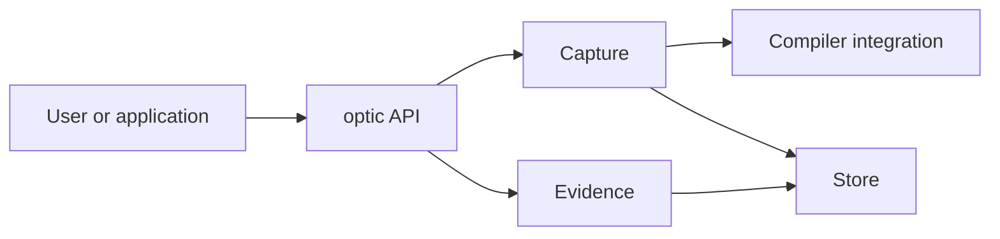
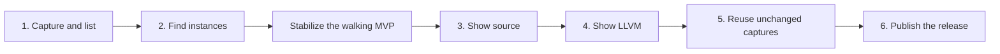

# MVP plan

This document describes the first implementation milestone for Cargo Optic. The milestone grows
through small, user-visible changes.

The [MVP architecture](mvp-architecture.md) describes the complete package set. The
[future architecture](future-architecture.md) describes the long-term product boundaries.

The prototype proves important behavior, but it is not the starting implementation. The new code
starts with the simplest design that preserves the proven correctness rules.

## Goal

The first milestone supports this workflow:

```console
cargo optic capture -p my-crate --lib --release
cargo optic list-captures
cargo optic find --capture CAPTURE_REF kernel
cargo optic show --instance INSTANCE_REF --output source
cargo optic show --instance INSTANCE_REF --output llvm
```

This workflow proves one complete path from Cargo to stored compiler evidence. It also proves that
another application can use the same library API.

## First subsystem set

The first milestone uses these packages:

| Package | Role in the milestone |
| --- | --- |
| `cargo-optic-records` | Define durable identifiers, ranges, and records. |
| `cargo-optic-compiler` | Run Cargo and collect compiler evidence. |
| `cargo-optic-store` | Publish captures and read stored artifacts. |
| `cargo-optic-capture` | Turn user intent into one complete capture. |
| `cargo-optic-evidence` | Find instances and read source or LLVM evidence. |
| `cargo-optic-api` | Provide the `optic` library API. |
| `cargo-optic` | Provide the `cargo optic` command-line interface. |

Each package enters the workspace with useful behavior. The milestone does not create empty
packages for later subsystems.



## Implementation approach

The first implementation uses direct code and concrete types. It does not add backend traits for
possible future implementations.

The store can use ordinary files or another simple local format. Its public API does not expose the
chosen layout.

Queries can scan all records. Capture can compile the driver and selected target every time.

The code does not copy prototype optimizations unless correctness requires them. Examples include
caches, compression, recovery, concurrency, and content deduplication.

The first implementation supports the ordinary Unix and rustup workflow. It uses `rustc` from
`PATH` and rejects an explicit compiler override. It disables an existing compiler wrapper for the
capture and prints a warning because the captured output can differ from a normal wrapped build.

Do not add code for an unsupported environment before a user reports the need. Return an error for
an unexpected case. Add support in a later change with a fixture that reproduces the environment.

This rule excludes response-file parsing, Windows process handling, non-executable temporary
filesystems, and arbitrary limits on the private driver manifest from the first milestone. Durable
store readers can use size limits because they read untrusted persistent data.

## Compatibility during initial development

Cargo Optic has no existing users during initial development. Every version change is breaking by
default, including changes to commands, library APIs, records, and store layouts.

The project makes no guarantee about state from older versions. Do not add backward compatibility,
migrations, legacy-layout detection, or cleanup paths only to support older versions. Running newer
code against older state can return an error or panic. Backward compatibility and migrations remain
future release work.

## Pull-request stack

Each pull request adds one behavior that a reviewer can use and observe. A pull request can change
several subsystem packages to complete that behavior.



Each pull request targets the branch before it. Reviewers can read the stack in the same order as
the product workflow.

Implementation status:

- [x] Capture and list ([PR #5](https://github.com/connortsui20/optic/pull/5)).
- [ ] Complete the walking-MVP stack in PRs #14, #9, and #6.
- [ ] Complete the [stabilization plan](stabilization.md).
- [ ] Show captured source.
- [ ] Show exact LLVM IR.
- [ ] Reuse unchanged captures.
- [ ] Publish the vertical slice.

### Pull request 1: capture and remember a Cargo invocation

Review question: Can Cargo Optic run one explicit Cargo invocation and record that it succeeded?

```console
cargo optic capture -p my-crate --lib --release
cargo optic list-captures
```

This pull request introduces the smallest useful parts of the records, compiler, store, API, and
CLI packages. The API coordinates this first straight-line capture workflow directly.

The CLI requires one package, one target selector, and one profile selector. Target selectors use
Cargo syntax: `--lib`, `--bin NAME`, `--example NAME`, or `--bench NAME`.

The capture command accepts `--features FEATURES`, `--all-features`, and `--no-default-features`.
It applies the same feature selection to Cargo metadata and `cargo rustc`.

The compiler package resolves the package and target with Cargo metadata. It runs `cargo rustc` from
the original invocation directory. It does not replace or inspect the existing compiler-wrapper
chain.

A successful Cargo invocation creates one new capture. This rule also applies when Cargo reuses a
fresh target and does not invoke rustc.

The capture record contains these fields:

- The capture ID and completion timestamp.
- The selected package name and version.
- The selected target kind and name.
- The selected Cargo profile.
- The Cargo executable and ordered arguments.
- The original invocation directory.

The store writes the record in a private staging directory. One directory rename commits the
capture to the completed namespace. A pre-commit error leaves no visible capture.

The rename provides atomic visibility. This pull request does not guarantee persistence after a
system crash or power loss. It does not add platform-specific directory synchronization or a
post-commit durability warning.

This pull request does not:

- Claim that Cargo invoked rustc.
- Record or verify the compiler identity.
- Force Cargo to rebuild a fresh target.
- Install an exact-version driver.
- Record instances, source, LLVM IR, or optimization remarks.
- Add capture reuse, recovery, concurrency, or dependency capture.
- Read unpublished legacy capture ID formats.

Pull request 2 obtains the compiler identity from the actual selected-target compiler invocation. It
also adds the first compiler evidence.

Completion criterion:

> A user can run one explicit Cargo invocation and list its completed capture.

### Pull request 2: find concrete instances

Review question: Can Cargo Optic report the concrete Rust instances from the build?

```console
cargo optic find --capture CAPTURE_REF kernel
```

This pull request introduces the capture package because compiler evidence gives it a distinct
planning and collection responsibility. It also adds the exact-version rustc driver, the first
useful evidence query, and the minimum definition, instance, placement, and symbol records.

The driver records the compiler identity from the selected-target compilation. The evidence package
searches exact names first and then uses a literal substring.

The selected target must reach rustc analysis before the driver completes its manifest. A compiler
probe does not meet this condition, so capture returns an error and publishes nothing.

A generic fixture produces at least two concrete instances. An instance with no standalone body is
still a valid result.

Completion criterion:

> A user can select a capture and find its concrete compiler instances.

### Stabilization: protect and simplify the walking MVP

Review question: Can agents change the prototype without inventing behavior or depending on local
machine state?

This phase adds Linux and macOS CI, current architecture documentation, a small shared test harness,
complete walking-MVP contract coverage, and one test-backed simplification pass.

The phase does not add a product command or evidence type. The detailed pull requests and exit
criteria are in the [stabilization plan](stabilization.md).

Completion criterion:

> The walking MVP has explicit contracts, hermetic tests, and the minimum implementation that
> satisfies them.

### Pull request 3: show captured source

Review question: Can Cargo Optic show the source that belonged to a selected definition?

```console
cargo optic show --instance INSTANCE_REF --output source
```

This pull request adds source snapshots, source-span relationships, and bounded source reads. The
reader uses the captured file instead of the current checkout.

The compiler accepts source only from approved local package roots. Missing source is a valid
availability result.

Completion criterion:

> A user can read the captured source for one selected instance.

### Pull request 4: show exact LLVM IR

Review question: Can Cargo Optic show optimized LLVM IR for the exact concrete instance?

```console
cargo optic show --instance INSTANCE_REF --output llvm
```

This pull request emits optimized LLVM IR and scans each module by line. It records byte ranges for
function bodies.

An exact raw symbol connects an instance to an LLVM body. Similar display text never creates this
relationship.

The result distinguishes an available body from an optimized-away body. The reader does not parse
the complete LLVM module into memory.

Completion criterion:

> A user can read exact LLVM evidence or see that no standalone body exists.

### Pull request 5: reuse unchanged captures

Review question: Does an identical second capture reuse complete evidence without rebuilding the
selected target or the exact-version driver?

This pull request ports the prototype cache design after the complete evidence format exists. A
request key selects one completed capture and its saved analysis fingerprint. Cargo remains the
authority for freshness and evaluates that exact fingerprint in the normal target directory.

If Cargo reports that the selected target is fresh, Cargo Optic returns the existing capture. It
does not publish a duplicate capture. If Cargo invokes rustc, Cargo Optic publishes new evidence and
updates the request key to select the new capture and analysis fingerprint.

The analysis fingerprint remains stable across normal matching requests. `--fresh` creates a new
analysis fingerprint and captures new evidence. Cargo Optic does not reconstruct or predict Cargo's
internal fingerprint.

The same pull request caches the exact-version driver by compiler identity, driver source digest,
and protocol version. An identical second capture does not compile the driver again.

This pull request does not add storage budgets, interrupted-ingestion recovery, concurrent cache
provisioning, compression, or content deduplication from the prototype.

The end-to-end test performs these operations:

1. Capture a target and record that Cargo invoked rustc.
2. Repeat the same request and receive the same capture ID without a rustc invocation.
3. Change a tracked source input and receive a new capture ID from a new rustc invocation.
4. Use `--fresh` and receive a new capture ID even when Cargo can reuse the prior analysis.
5. Repeat a matching request and make sure that the driver executable does not change.

Completion criterion:

> Cargo validates freshness before Cargo Optic reuses complete evidence for an unchanged request.

### Pull request 6: publish the vertical slice

Review question: Can another person install and use the release safely?

This pull request completes release metadata, public documentation, errors, and package tests. It
also removes or documents each release-blocking TODO.

The package test installs Cargo Optic outside the source workspace. It then performs the documented
workflow against a fixture project.

This pull request does not add a major product feature.

Completion criterion:

> A crates.io installation completes the documented workflow outside the source workspace.

## Correctness rules

The first milestone preserves these rules from the prototype:

- The selected Cargo target uses the workspace toolchain.
- Cargo runs from the original invocation directory.
- The compiler connection disables an existing wrapper and prints a warning.
- A PR1 capture records a successful Cargo invocation, not a verified rustc invocation.
- Compiler identity comes from the selected-target compilation in PR2.
- The exact-version driver records concrete instances and raw symbols.
- Display names do not connect instances to LLVM bodies.
- Each read uses an explicit capture or instance reference.
- A captured source result reads the stored snapshot.
- A reader sees one complete capture or no capture.
- An error before store commit leaves no visible capture.
- Stored byte ranges use 64-bit offsets and lengths.
- Invalid current-version stored data returns an error.
- Missing compiler evidence remains a valid result.

Cache reuse is correct only when Cargo accepts the saved analysis fingerprint as fresh. Prototype
storage optimizations do not define correctness.

## Test strategy

Each pull request includes one end-to-end test for its review question. Package tests cover the
local invariants that support that behavior.

The [test strategy](test-strategy.md) defines the test levels, hermetic environment, CI matrix, and
future feature cases. That document owns test infrastructure decisions.

The fixture set contains these cases:

- One non-generic local function.
- One generic function with at least two concrete instances.
- One function with no standalone optimized body.
- One source file with a space in its name.
- One existing compiler wrapper that capture disables with a warning.
- One invalid stored range.
- One collection error before publication.

The final package test runs outside the Cargo Optic workspace. This test protects packaged driver
source, paths, metadata, and installation behavior.

## TODO policy

TODO comments can record deliberate omissions. Each TODO names one missing behavior and the reason
that it remains outside the current pull request.

A public function cannot call `todo!()` or `unimplemented!()`. An empty package cannot reserve a
future boundary.

Broad future work belongs in design documents or issues. A source TODO stays next to one concrete
missing action.

## Review policy

Each pull request has one user-visible claim. The pull-request description states that claim, its
correctness rules, and its known limits.

An independent agent reviews every changed implementation line before merge. A conforming pull
request can auto-merge after its required checks pass.

An implementation agent stops when a change needs behavior that the planning documents do not
authorize. The [agent workflow](agent-workflow.md) defines the review and merge gates.

An optimization enters the milestone only after the simple implementation causes a measured
problem.

## Outside the first milestone

The first milestone does not include:

- Recovery of interrupted work.
- Concurrent captures.
- Automatic dependency capture.
- Full-text search.
- Store federation.
- Labels, pins, retention, removal, or garbage collection.
- Cross-capture identity.
- Attribution explanations.
- Comparison.
- General operation events or cancellation.
- MIR, optimization reports, assembly, objects, or linked products.
- Compression or content deduplication.
- Backward compatibility or migrations.
- JSON Lines output.
- A TUI, server, daemon, web interface, or IDE extension.
- Custom compiler selection or compiler-wrapper composition.
- Windows hosts or rustc response-file parsing.

These features remain part of the complete architecture. They are not incomplete parts of the first
milestone.
